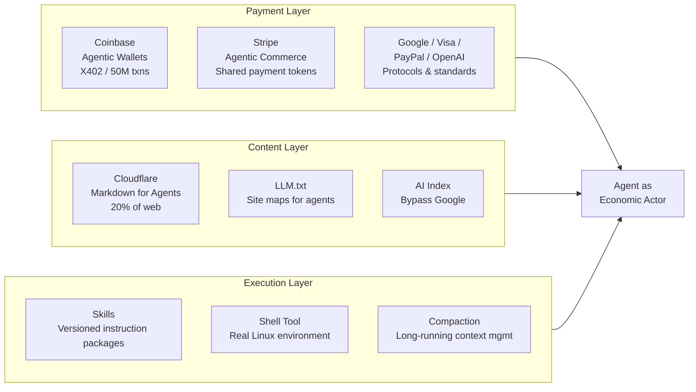

**Parent**: [[topics]]

# Agent Infrastructure: Payment, Content & Execution

## Overview
Within hours of each other, Coinbase, Cloudflare, and OpenAI each shipped a major infrastructure primitive for the agentic web — without coordinating. The convergence was not coincidental; all three companies are responding to the same signal: autonomous agents need money, readable content, and execution environments to do useful work on the web. Each of these launches represents an infrastructure-layer commitment to agents as first-class web clients.

---

## Payment Layer: Coinbase Agentic Wallets

### What It Is
Crypto wallets designed for agents, not people, built on the **X402 protocol** — a payment standard that has already processed over **50 million machine-to-machine transactions**.

### Key Capabilities
- **Programmable spending limits and session caps** — agents can transact within defined financial guardrails
- **Gasless trading** on Coinbase's Base network
- **Non-custodial architecture with enclave isolation** — private keys sit in secure hardware the agent cannot access, so a compromised agent cannot leak keys
- Developers can spin up a wallet in under 2 minutes via command line

### Use Cases Coinbase Is Targeting
- Agents autonomously rebalancing DeFi portfolios
- Agents paying for API calls as they make them
- Agents purchasing compute on demand
- Agents participating in creator economies

### What This Creates
A category of software that has never existed before: agents that can **earn, spend, and accumulate capital independently of the humans who created them**. The legal implications of truly independent AI economic actors remain largely unresolved.

---

## Payment Layer: Stripe Agentic Commerce

Stripe's **Aenta Commerce Suite** (launched December 2024) allows businesses to connect product catalogs and sell through AI agents with a single integration.

### Shared Payment Tokens
A new payment primitive: scoped, time-constrained credentials that let an agent initiate a purchase using a buyer's saved payment method **without ever seeing the card number**.

### Fraud Detection Rebuilt from Scratch
Stripe's Radar fraud system had to be completely retrained because every signal it used was calibrated for human shopping behavior:
- Mouse movement variability
- Browsing time and session behavior
- Device fingerprinting

None of these signals exist when the buyer is software. Stripe had to build an entirely new fraud model for a client that is, by any prior definition, a bot — except now bots are purchasers.

### Industry Convergence
Every major payment company reached the same conclusion independently within the same window:
- **Google**: Agent Payments Protocol (September)
- **PayPal + OpenAI**: Instant checkout in ChatGPT
- **Visa**: Trusted Agent Protocol (NRF 2026)
- **Google**: Universal Commerce Protocol (open standard)
- **Stripe ACS**: Auto-supports Google's protocol — merchants on Stripe are immediately compatible with Google's agent shopping infrastructure without writing additional code

---

## Content Layer: Cloudflare Markdown for Agents

### The Problem It Solves
HTML is designed for human browsers — bloated with scripts, tracking pixels, navigation menus, and ads. Every time an agent needs to read a web page, it must strip all of that away and convert it to something useful (usually markdown). An entire category of companies (Firecrawl, Exa) exists purely to do this conversion.

### How It Works
When an AI agent requests a page from any Cloudflare-enabled site, it sends an `Accept` header. Cloudflare:
1. Intercepts the request
2. Fetches the HTML from the origin server
3. Converts it to markdown on the fly
4. Returns it with an `X-Markdown-Tokens` header containing the estimated token count so the agent can manage its own context window

Cloudflare serves roughly **20% of the web**. This is an infrastructure-level declaration that agents are first-class web clients.

### Companion Features in the Same Release
- **LLM.txt / LLMs-full.txt**: Standardized machine-readable site maps — the equivalent of `robots.txt` but for agents, telling them what's on a site and how to navigate it
- **AI Index**: An opt-in search index where sites make content discoverable to agents directly through Cloudflare's MCP server and search API — bypassing Google entirely
- **Built-in X402 monetization**: Site owners can charge agents for content access using the same protocol as Coinbase's wallets

Cloudflare is not just making the web readable for agents. It is building an economic layer for a web where **agents pay to access content**.

---

## Execution Layer: OpenAI Skills, Shell & Compaction

### Skills: Versioned Instruction Packages
Skills are reusable, versioned instruction bundles — more like Docker images than chat templates. An organization can:
- Build a Salesforce skill, test it, lock the version
- Deploy it across every agent in the company
- Guarantee every agent follows the same procedure
- Update all agents at once by releasing a new version

This is the difference between artisanal prompt engineering and **software engineering applied to AI operations**. Glean (enterprise search) saw accuracy on Salesforce tasks jump from **73% to 85%** with a single well-structured skill, plus an **18% decrease in time to first token**.

### Shell Tool: Real Execution Environment
The shell tool gives agents a real Linux terminal environment — not a sandbox — where they can:
- Install software dependencies
- Run scripts
- Write output files to disk
- Fetch external data

The pattern is functionally identical to how a human freelancer works: read the brief, set up tools, do the research, deliver the artifact. Agents now do this inside a container in seconds.

### Compaction: Long-Running Workflow Support
Any agent running for an extended period accumulates context — search results, API responses, calculations, conversation history — until the context window fills up, causing drift or crashes. Compaction handles this server-side: it automatically summarizes and compresses context to keep the agent operational across workflows measured in hours rather than minutes. This makes agents viable for sustained multi-step enterprise work at scale.

---

