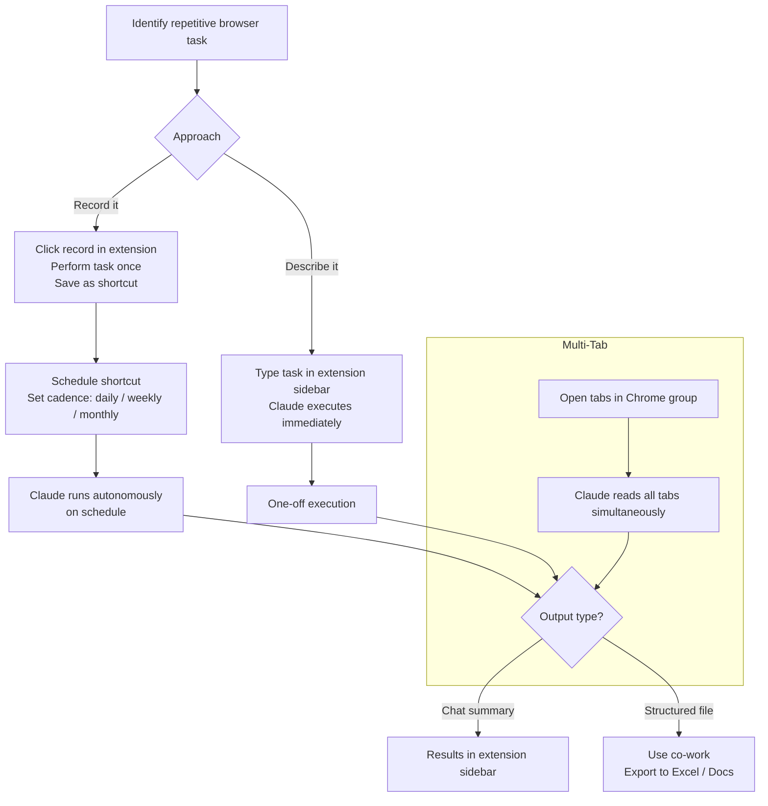

**Parent**: [[topics]]

# Browser-Based Workflows with the Claude Chrome Extension

## Overview
The Claude Chrome extension turns the browser into an autonomous agent workspace. Rather than answering questions while a human browses, the extension does real work on the user's behalf — clicking, navigating, reading, extracting, and submitting — with no human involvement required once a workflow is configured. The core mental shift is from optimizing for questions to optimizing for workflows: identify repetitive browser tasks, describe or record them once, and offload them to Claude on a schedule.

## Core Concept: Browser Agent vs. Chatbot

> *"With a chatbot, you optimize for your own questions. With a browser agent, you optimize for your workflows."*

The extension is not a sidebar assistant. It is an agent that can operate an entire browser session independently — reading page content, filling form fields, clicking buttons, navigating between pages, and synthesizing results — as long as the task is well-defined.

## Workflow Recording & Scheduling
The extension's record-and-schedule feature is its most powerful capability for recurring work:

1. Click the **record icon** in the extension panel
2. Perform the task once in the browser (pull analytics, check a pricing page, scan an inbox, etc.)
3. Stop the recording and save it as a **shortcut**
4. Click the **clock icon** to set a cadence — daily, weekly, monthly
5. Claude runs the workflow on autopilot without reminders or human involvement

Example recurring tasks that transfer well:
- Pulling numbers from a dashboard for a weekly report
- Extracting new LinkedIn connection requests
- Scanning an inbox for specific categories of email
- Checking competitor pricing pages
- Monitoring a neighborhood restaurant listing

## Google Workspace Integration
Anthropic has built native platform knowledge into the extension for the most widely used web applications. Claude recognizes and can navigate Gmail, Google Calendar, and Google Drive without step-by-step instructions from the user.

Validated use cases:
- **Gmail**: Scan inbox, categorize emails, identify marketing vs. important messages
- **Google Calendar**: Review open slots, propose meeting times, draft event invitations
- **Google Drive**: Organize loose documents into a logical folder structure, sort into subfolders, flag duplicates (tested at ~900 documents)

**Caution on automated email sending**: Auto-drafting or auto-sending replies to important stakeholders is high-risk at this stage. Claude may send the wrong message or hit send instead of saving a draft. Use the extension for inbox and Drive cleanup; manually review any outbound communication to stakeholders before it goes out.

## Multi-Tab Workflows & Structured Output
For tasks spanning multiple sources, Claude can work across an entire Chrome tab group simultaneously rather than site by site:

- Drag relevant tabs into a designated Chrome tab group
- Claude reads and interacts with all tabs in the group; it cannot see tabs outside it
- Synthesizes content across all tabs into a single structured output

For tasks that need a file output (Excel, structured document), use **co-work** instead of the extension — co-work can extract data from the same tab group and write it directly into a formatted spreadsheet or presentation.

## Developer Use Cases
Developers can use the extension (or Claude Code + browser) for web testing without a dedicated QA setup:

- **Smoke tests on a schedule**: Record a test checkout or key user flow, schedule it to run daily, and Claude flags if something breaks
- **Figma-to-build loop**: Claude builds from a Figma mock in the terminal, a second Claude instance opens Chrome and verifies the rendered output against the mock, and the loop continues until the build matches — human just watches
- Non-developers can use the extension's record feature to set up basic scheduled tests; developers working in Claude Code can drive Chrome directly from the terminal for more sophisticated debugging

## Limitations
**Data-heavy tasks degrade**: When a recorded workflow spans many contacts, posts, or data sources, coverage can become spotty. Claude may miss expected items or surface tangential updates instead of the most relevant content. The root cause is LLM salience detection across a large open context window.

*Mitigation*: Break large-scope workflows into smaller, focused subtasks. A clean subtask run on a schedule is more reliable than one broad workflow attempting to cover everything.

**Model tier matters**: Simpler subscription plans provide access to less capable models. Complex tasks — multi-profile LinkedIn summarization, large inbox triage, Drive reorganization — perform better on Max, Team, or Enterprise plans where frontier models are available.

## Security & Safe Usage
Deploying an LLM in an open browser context carries real risks:

- **Prompt injection**: Malicious text embedded in a web page can hijack the agent's instructions. If the agent has access to email in the same session, injected instructions could cause it to exfiltrate sensitive data.
- **Trusted sites only**: Do not use the extension on unfamiliar or untrusted sites. Avoid having sensitive accounts (banking, credentials) open in the same browser session as an active agent task.
- **Treat it like a capable new employee**: Verify outputs, don't grant unlimited permissions, and review any action with meaningful consequences before it's irreversible.

## Key Decisions / Open Questions
- Automated email replies remain risky — the send/draft boundary needs human oversight until trust is established with a specific workflow
- Data-heavy scheduled workflows should be broken into subtasks to maintain reliability
- The underlying skill — identifying and clearly describing repetitive work — generalizes across all AI interfaces, not just this extension
