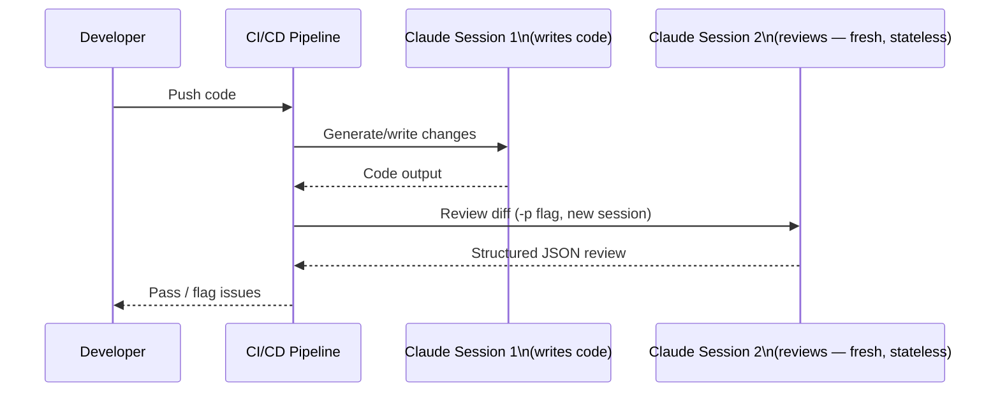

**Parent**: [[topics]]

# CI/CD Integration & Stateless Code Review

## Overview
Claude Code can be embedded in automated pipelines — not just used interactively. Two flags enable this: `--print` (non-interactive mode) and `--output-format json` (machine-readable output). Together, they turn Claude Code from a conversational tool into a scriptable automation component. A separate but related principle: code written in one session should always be reviewed in a different, stateless session.

## The `--print` Flag (Non-Interactive Mode)
The `-p` / `--print` flag runs Claude Code without prompting for confirmation or input. It executes the given task and returns the result directly. This enables Claude Code to be triggered from:
- CI/CD pipelines (GitHub Actions, Jenkins, etc.)
- Automated testing and deployment workflows
- Any system that needs structured output from Claude without human interaction

Combined with `--output-format json`, the output is structured and parseable by other tools in the pipeline — transforming Claude Code into a programmable component rather than a chat interface.

## The Automated Code Review Pattern
A typical pipeline with Claude Code in the review stage:

1. Developer pushes code
2. CI pipeline triggers automatically
3. Claude Code (`-p` flag) reviews the diff in a **fresh, stateless session**
4. Structured JSON output returned to the pipeline
5. Pipeline proceeds or blocks based on the result

## Why Reviews Must Be Stateless
A session that *wrote* the code is biased toward validating it. The model that produced an output has effectively "committed" to it — it will rationalize rather than critique. A fresh session with no prior history approaches the same code without that bias.

> *"Fresh eyes, even AI eyes, catch more. Two heads are better than one — in Claude Code's case, 5, 10, or 15 heads reviewing in separate sessions catch what the first session never would."*

This mirrors the standard software engineering practice of separating the author from the reviewer. The principle applies equally to AI-generated code.

## Practical Example
```
claude -p "List all Python files in this project and summarize what each one does" --output-format json
```
Returns a structured JSON summary readable by downstream pipeline steps — no human interaction required.


