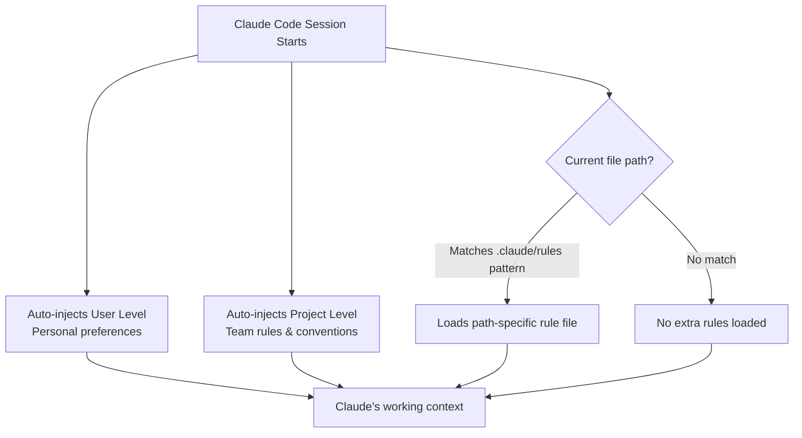

**Parent**: [[topics]]

# Claude.md Three-Layer Configuration

## Overview
Claude.md files are the operating system and air traffic control of a Claude Code project — defining the rules, preferences, and context that Claude auto-injects at the start of every session. The most common mistake is treating Claude.md as a knowledge base, dumping all preferences, rules, style, and tone into one giant file. This wastes tokens on every session and loads irrelevant context for every task. The exam guide prescribes a three-layer architecture that keeps Claude focused and token-efficient.

## The Problem with One Giant File
Every time a new Claude Code session opens, the Claude.md file is auto-injected into memory. A monolithic file means:
- Tokens wasted on irrelevant content for every task
- Claude treating all rules as equally applicable to all contexts
- Bloated context window from the very start of each session

Claude.md is not a proxy for a knowledge base or RAG system. It is an instruction layer — and instruction layers should be minimal.

## The Three Layers

### Layer 1: User Level (Personal Preferences)
Lives in the home directory. Not shared via version control.
- Editor settings
- Preferred explanation style and formatting
- Personal shortcuts and conventions

**Scope:** You only. Private, non-transferable.

### Layer 2: Project Level (Team Rules)
Lives at the project root. Checked into version control and shared with the team.
- Coding conventions and standards
- Architecture decisions
- Shared workflows all team members should follow

**Scope:** Everyone on the team. Shared via git.

### Layer 3: Path-Specific Rules (The High-Leverage Layer)
Small rule files in the `.claude/rules/` folder. Each file has a pattern header specifying when to load it.

Examples:
- Testing rules load only when editing test files
- API rules load only when working in the `/api` folder
- Component rules load only when in the components directory

**Scope:** Context-specific. Loads only when relevant — the main Claude.md stays lean, and rules show up only where they apply.

## Key Principle
Keep the always-loaded layers minimal. Use path-specific rules to carry nuance for specific contexts. The leaner the injected context, the more focused Claude's attention is on the actual task at hand.

