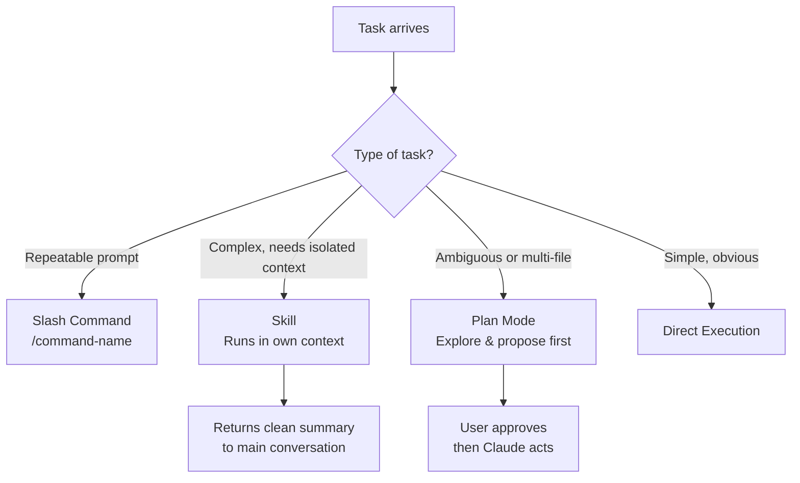

**Parent**: [[topics]]

# Commands, Skills & Plan Mode

## Overview
Claude Code offers three levels of structured, reusable interaction: slash commands for saving repeatable prompts, skills for isolated multi-step workflows, and plan mode for exploratory work that shouldn't make changes. Knowing when to use each avoids both over-engineering simple tasks and under-equipping complex ones.

## Slash Commands: Reusable Prompts
Commands are saved prompts triggered with a slash prefix — `/review-pr`, `/generate-tests`, `/morning-briefing`, etc.

- **Team commands**: live in the project's `commands/` folder, shared via git; anyone on the team can invoke them
- **Personal commands**: live in your root folder, specific to you; tailored to your day-to-day workflow

Use commands for repeatable, well-defined tasks that benefit from a consistent prompt structure but don't require isolated context.

## Skills: Isolated Context Units
A skill is a step above a command. Each skill has its own file defining:
- What it can do
- Which tools it's allowed to use
- Its own isolated context window

Skills do their exploratory, messy work in a separate context — file reads, research, iterations — and return only a clean summary to the main conversation. Think of it as sending someone to another room to do research, then receiving just the conclusions.

**Key benefit:** Complex skills don't pollute the main conversation context with intermediate tool calls, partial results, and exploratory noise.

## Plan Mode: Explore Before Acting
Use plan mode when a task:
- Touches multiple files
- Is ambiguous or could go in several directions
- Has consequences worth reviewing before executing

In plan mode, Claude reads, explores, and proposes changes without modifying anything. Review and approve before any action is taken.

**Skip plan mode** for obvious, single-file fixes — over-planning simple tasks is its own form of inefficiency.

## Decision Guide

| Situation | Tool to Use |
|---|---|
| Repeatable prompt, shared with team | Team slash command |
| Personal frequently-used prompt | Personal slash command |
| Complex multi-step task; keep main context clean | Skill |
| Ambiguous task touching multiple files | Plan mode first |
| Simple, obvious single-file change | Direct execution |

