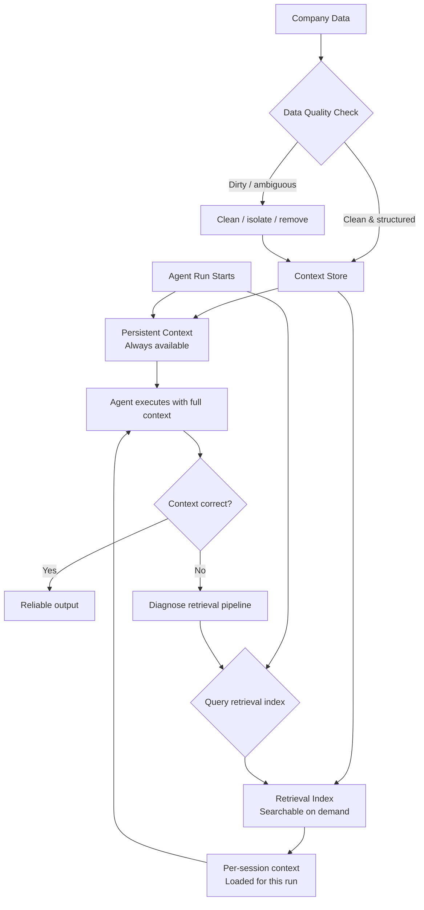

**Parent**: [[topics]]

# Context Architecture

## Overview
Context architecture is the skill of designing the data and retrieval systems that supply agents with the right information at the right time. It is the 2026 evolution of what was called "getting the right documents into the prompt" in 2024. Done well, a strong context architecture enables an organization to deploy not one agentic system but dozens — it is a foundational multiplier. Done poorly, agents hallucinate, retrieve irrelevant data, or fail silently because the information they needed wasn't available or wasn't findable.

## What Context Architecture Involves

### Persistent vs. Per-Session Context
- **Persistent context**: Information always available to the agent (system instructions, organizational facts, role definitions)
- **Per-session/per-run context**: Information the agent needs for a specific task, retrieved on demand

Designing the boundary between these — and the retrieval mechanisms that populate per-session context — is a core part of the skill.

### Data Quality and Cleanliness
Dirty, contradictory, or ambiguous data in the retrieval space confuses agents the same way it confuses humans — except agents won't ask for clarification. They will silently work with whatever they find.

Key concerns:
- Removing or isolating data that is outdated, incorrect, or contradictory
- Ensuring data objects are well-structured and easily traversable by agents
- Differentiating between what should be searchable and what should not be

### Traversability
Agents need to be able to find the right data object among many. This requires thinking about how data is organized, labeled, and indexed — not just whether it exists.

> *"Context architecture is like building the Dewey decimal system for agents. You have to understand how to build a library that an agent can easily search through."*

### Troubleshooting Context Problems
When agents start retrieving the wrong context — answering with stale data, pulling irrelevant documents, missing the right source — diagnosing the root cause requires understanding the full retrieval pipeline: what's being searched, how results are ranked, and what the agent sees.

## The Lost in the Middle Problem
Claude pays close attention at the beginning and end of what it's given, but content in the middle of a long context window gets fuzzy — this is known as "lost in the middle." Specifically:
- The first ~40% of the context window is well-primed (system prompt, opening messages, Claude.md injection)
- The final messages benefit from recency bias
- Everything in between receives less reliable attention

The problem compounds over a session: every tool call appends its result to the middle zone. A customer record returning 40 fields when only 5 are needed pushes important earlier content further into the fuzzy region.

### Three Mitigation Strategies

**1. Key fact pinning** — Extract the most critical facts and place them at the very top of the conversation, where Claude will always see them. A "key fact summary block" at the start keeps essential information outside the fuzzy zone regardless of how long the session grows.

**2. Trim verbose tool outputs** — Filter tool results before they enter the context window. Strip metadata and fields that don't move the task forward. Keep only what matters.

**3. Delegate to sub-agents** — Sub-agents contain all their messy intermediate output, tool calls, and exploratory steps in their own isolated context window. The main agent receives only a clean summary — keeping the coordinator's context window lean.

> Starting a brand new session with a summarized version of prior outputs is infinitely better than pushing through a polluted context window — even at a million tokens, the accumulated tool calls, pivots, and retries degrade attention quality.

## Why This Skill Commands Premium Compensation
Getting context architecture right enables an organization to scale agentic deployment across the entire business. It is not a one-system skill — it is an infrastructure skill. Companies that solve this can build dozens of agentic workflows on top of the same foundation.

> *"The people who can think through the data side of things logically and put that in front of an agent in such a way that they can verifiably show that the agent can do the work — those people can write their ticket."*

## Who Has a Head Start
- **Librarians and information architects** — experienced organizing knowledge for retrieval
- **Technical writers** — skilled at structuring information so it is findable and unambiguous
- **Data engineers** — familiar with data quality, schema design, and pipeline management

Engineering background is not required. The core skill is logical thinking about information organization.

