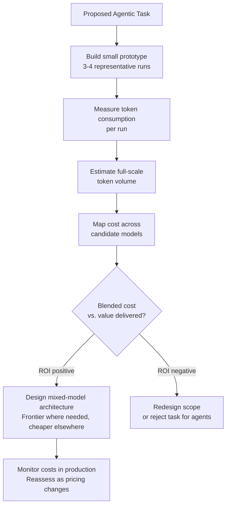

**Parent**: [[topics]]

# Cost and Token Economics

## Overview
Cost and token economics is the skill of calculating whether a given agentic workflow is financially viable before building it, and optimizing model selection and token usage to maximize ROI. As agentic systems burn millions or billions of tokens in production, the ability to size costs accurately and choose the right model for each task is a senior-level qualification — one that appears on almost every senior AI job posting and commands architecture-level compensation.

## The Core Problem
Agentic workflows are not cheap. A system processing millions of tokens daily at frontier model prices can cost far more than the value it generates. The skill is making that determination ahead of time and designing systems that are cost-efficient by construction.

Complicating factors:
- Multiple model tiers exist with very different price points
- Frontier model pricing is required for some tasks; cheaper models suffice for others
- Model pricing changes frequently and rapidly
- Token consumption varies by task structure, context size, and run length

## The Build/Don't-Build Decision
Before committing to an agentic solution, a practitioner with this skill can:
1. Estimate the token cost of the task (based on a small prototype run)
2. Map that cost across several candidate models
3. Calculate whether the ROI justifies the expense
4. Identify which subtasks require frontier model capability and which can use cheaper alternatives

> *"Is it worth it to build an agent for this job? You have to be able to go through and calculate the cost per token for a given task and reliably say, if I put an agent against this and it burns 100 million tokens, I can prove this is worth doing."*

## How to Apply This Skill in Practice
- Build a **cost calculator spreadsheet** with variables for token count and model weights
- Run a **small prototype** (3-4 representative tasks) to establish a realistic token baseline
- Calculate **blended cost** across a mixed-model architecture (some tasks on frontier models, others on smaller/cheaper models)
- Reassess regularly as model pricing changes

## The Math
The underlying arithmetic is straightforward — high school level. The premium comes from applying that math correctly in a fast-moving environment where:
- Pricing changes without warning
- Task complexity is hard to estimate without hands-on experience
- Model capabilities and cost curves shift with each new release

## Scope of Demand
This skill appears on senior engineering, architecture, operations, and product management postings. It is not engineering-exclusive — any role responsible for deploying or governing agentic systems needs people who can evaluate cost efficiency.

