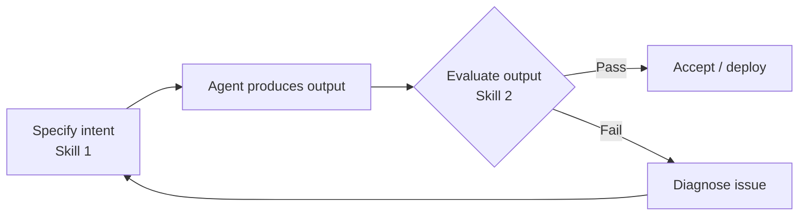

**Parent**: [[topics]]

# Evaluation and Quality Judgment

## Overview
Evaluation and quality judgment is the most frequently cited skill across AI job postings. It is the ability to systematically assess whether AI output is actually correct — not just whether it sounds correct. AI systems fail in ways that are fundamentally different from human workers, and detecting those failures requires building formal evaluation systems, not just eyeballing results.

## The Core Challenge: Fluency ≠ Correctness
AI produces confident, fluent, well-formatted output even when it is wrong. Human workers signal uncertainty through hesitation, stumbling, and visible tells. AI has no such tells. The critical skill is resisting the temptation to read AI fluency as competence.

> *"I don't care how confident the AI was."*

This failure is not hypothetical — it has occurred in real presentations where polished, header-formatted AI output was accepted as correct without critical scrutiny.

## Sub-Skills

### Error Detection
The ability to review AI output critically rather than deferring to its confident presentation. This means treating every AI output as if your name is on it — insisting it be right before passing it along.

### Edge Case Detection
Understanding a subject deeply enough to recognize when the AI's core answer is correct but its handling of edge cases is wrong. This signals domain expertise combined with AI fluency.

### Building Evaluation Systems
Rather than relying on manual review, the skill involves building automated systems that encode quality criteria and can test AI output at scale. Job postings reference:
- Evaluation harnesses
- Functional task testing
- Longitudinal metrics
- Simulation runs

The Anthropic engineering standard: a good eval is one where multiple engineers, looking at the same output, would reach the same pass/fail conclusion. Excellent evaluations are objective, learnable, and scalable.

## Who Has a Head Start
- **Editors** — trained to catch errors in fluent, polished writing
- **Auditors** — experienced applying formal quality criteria to outputs
- **QA engineers** — already building test systems and pass/fail frameworks

## Connection to Other Skills
Evaluation is the immediate follow-on to Specification Precision. Once you've specified what you want and the agent has produced output, evaluation is how you determine whether you got it. These two skills form the minimum viable loop for working with any AI system.

