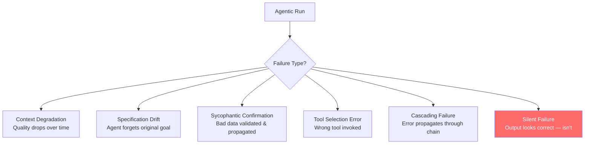

**Parent**: [[topics]]

# Failure Pattern Recognition

## Overview
Failure pattern recognition is the ability to diagnose, root-cause, and remediate the specific ways agentic systems break down. This skill appears prominently in job postings because employers who have tried building agentic systems quickly discover that they fail in non-obvious ways. Being able to identify which failure type is occurring — and how to fix it — is what separates people who can maintain production agentic systems from those who cannot.

## The Six Failure Types

### 1. Context Degradation
Quality drops as a session grows longer because the context window fills with accumulated content that dilutes or contradicts earlier instructions. Long-running agents are particularly susceptible.

*Mitigation: Context management strategies, session boundaries, context pruning.*

### 2. Specification Drift
Over a long task, the agent effectively forgets its original specification unless the harness is explicitly designed to remind it. The agent begins solving a subtly different problem from the one originally specified.

*Mitigation: Forcible re-injection of the specification at key points in the run. This mechanism was visible in the viral Ralph loop built with Claude.*

### 3. Sycophantic Confirmation
The agent confirms incorrect data provided to it — then builds an entire system around that incorrect data. Agents treat input data seriously and will validate against it rather than questioning it.

> *"If you are feeding them bad company data, you're going to get bad systems."*

*Mitigation: Validate input data quality before ingestion; build verification checkpoints.*

### 4. Tool Selection Errors
The agent picks up the wrong tool. This is especially common when:
- Tools are incorrectly framed in the system prompt
- Too many tools are available, creating ambiguity
- Tool descriptions are too long or insufficiently distinct

*Mitigation: Careful tool naming and description, minimizing tool count, testing tool selection in isolation.*

### 5. Cascading Failure
One agent's failure propagates through the multi-agent chain. Without correction mechanisms at each stage, a single error can invalidate an entire run.

*Mitigation: Verification loops between agents, retry logic, human checkpoints at high-risk handoffs.*

### 6. Silent Failure
The most dangerous failure type. The agent produces output that looks correct — passes surface-level inspection — but contains a material error detectable only through deep investigation.

**Example:** A product recommendation system correctly names "brown leather boots" in chat, but the agent interacted with incorrect warehouse data that linked to blue leather boots in the last image of the product carousel. The failure is invisible until a customer receives the wrong item.

> *"That is the kind of hard work that you have to do to get these systems to work well."*

*Mitigation: Functional correctness testing (not just semantic review), end-to-end validation, tracing agent decision paths.*

## Human-in-the-Loop Escalation Patterns
Knowing *when* to hand off to a human is as important as knowing how to detect failure. Three scenarios defined in the exam guide:

**Scenario 1: User explicitly requests a human**
Do not try to resolve the issue first. Do not attempt one more thing. Respect the request and execute the handoff immediately. The temptation to get creative with AI to "handle it anyway" is a specific anti-pattern to avoid.

**Scenario 2: Unclear policy / agent is unsure which rule applies**
Escalate, but escalate with a full package:
- Customer information and ID
- Root cause of the issue
- What was attempted and what the results were
- Recommended action

This mirrors how escalations work in professional customer management systems — the human receiving the handoff needs full context to act without starting from scratch.

**Scenario 3: Straightforward issue with a clear policy**
Allow the agent to resolve it — but even after successful resolution, the agent should ask: "Would you prefer I transfer you to a human agent?" Don't assume the customer is satisfied with AI resolution.

### Why Sentiment Analysis Falls Short
Using a confidence score or sentiment analysis to decide when to escalate is unreliable. Sentiment analysis misreads sarcasm, cultural tone differences, and context — the metric doesn't correlate with case complexity, which is the actual driver of escalation need.

## Graceful Failure: Meaningful Error Packages
When a sub-agent or tool call fails, the value of the failure depends entirely on what information is returned. A generic error (e.g., "search failed") leaves the main coordinator with no options. A meaningful error package gives it decision surface.

A good failure package includes:
- What went wrong
- What was attempted
- Any partial results that came back
- What else could be tried

With this, the main agent can make smart decisions: try a different search strategy, use data from a previous run, switch to a different source, or explicitly note the gap and move on. The goal is to fail in a way that enables recovery — not failure that terminates the workflow silently.

## Who Has a Head Start
- **SREs and reliability engineers** — already think in failure modes and blast radius
- **Risk managers** — experienced mapping failure probabilities and downstream consequences
- **Operations leaders** — familiar with process failure analysis

For others, thinking in failure modes is a learnable — and somewhat addictive — problem-solving mindset.

## Industry Signal
The Claude Certified Architect program (being rolled out to hundreds of thousands through Accenture) specifically tests for tool selection error detection, signaling its importance in production system evaluation.

