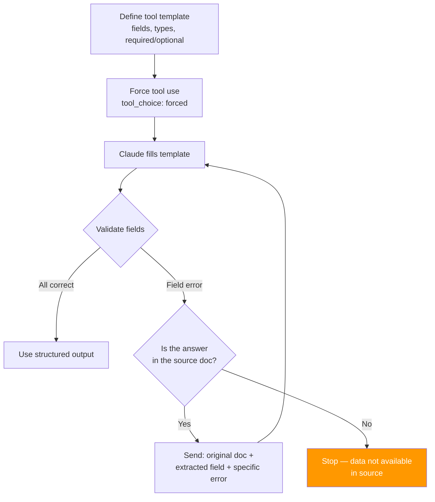

**Parent**: [[topics]]

# Few-Shot Examples & Structured JSON Output

## Overview
When Claude produces inconsistent outputs — varying formats, different number representations, missing fields — the instinct is to write more detailed instructions. The exam guide is explicit: this instinct is wrong. Two to three concrete examples of the desired output will outperform a full page of written instructions every time. Claude learns the underlying pattern from examples, not just the surface format.

## Why Examples Beat Instructions
Language models interpret instructions differently across runs. The same instruction can yield three different outputs depending on the model, phrasing, and context state. Examples give the model a pattern to generalize from rather than rules to parse.

> *"Claude doesn't just copy-paste your examples. It learns the underlying patterns behind them. That's why two to three examples will beat a full page of instructions each and every single time."*

Multishot prompting (2–3 examples) is sufficient for Claude to generalize. The examples teach the pattern; additional instructions add marginal value at best.

## Few-Shot Example Structure
For each example, provide:
- **Input**: the raw data or query (e.g., "Acme Corp reported 4.2M in revenue for 2024")
- **Output**: exactly the format you want (JSON, markdown table, specific structure)

Cover the range of variation in your examples — different currencies, edge cases, optional fields — rather than writing rules to cover each case.

## Structured JSON Output with Forced Tool Use
For workflows requiring guaranteed JSON structure:

1. **Define a tool** as a template — every field, every data type, optional vs. required. Marking a field as optional lets Claude legitimately return null rather than fabricating a value.
2. **Force tool use** (`tool_choice: forced`) — Claude must fill the template; no plain-text responses, no alternative tools.

**What this eliminates:** syntax errors — malformed JSON, markdown wrapping around JSON, inconsistent field names.

**What this does NOT eliminate:** semantic errors — a syntactically correct field with the wrong value.

## Validation Loop for Extraction Tasks
Simple retries are insufficient when extraction fails. Specific feedback is required:

1. Extract the data using the forced tool
2. Validate each field against the source document
3. If a field is wrong, send back: the original document + the extracted field + the specific error
   - Example: *"Revenue field says 0, but document clearly states 4.2 million"*
4. Know when to stop: if the information isn't in the source document, retrying — however precisely — won't help

