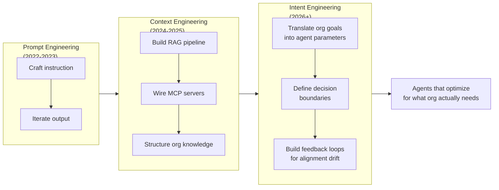

**Parent**: [[topics]]

# Intent Engineering: The Third Discipline

## Overview
Three distinct disciplines have emerged in the age of AI, each one necessary but insufficient on its own. Prompt engineering was personal and session-based. Context engineering is organizational and infrastructure-based. Intent engineering — the discipline that almost no organization is building for yet — is the practice of encoding organizational purpose into the systems that agents operate within, so that autonomous systems optimize for what the organization actually needs, not just what they can measure.

## The Three-Generation Evolution

### Generation 1: Prompt Engineering
- **Level**: Individual
- **Mode**: Synchronous, session-based
- **Practice**: Craft an instruction, iterate on output in a chat window
- **Value**: Personal productivity
- **Era**: Produced a thousand "how to write the perfect prompt" blog posts — most of them unhelpful

### Generation 2: Context Engineering
- **Level**: System
- **Mode**: Infrastructure-based, persistent
- **Practice**: Craft the entire information state an AI system operates within — RAG pipelines, MCP servers, vector stores, organizational knowledge
- **Value**: Agent capability at scale
- **Era**: Where the industry is currently focused; necessary but not sufficient

> *"Context engineering tells the agents what to know. Intent engineering tells agents what to want."*

### Generation 3: Intent Engineering
- **Level**: Organizational
- **Mode**: Structural, encoded into agent infrastructure
- **Practice**: Translate organizational goals, values, trade-off hierarchies, and decision boundaries into structured, machine-actionable parameters
- **Value**: Agents that optimize for what the organization actually needs, not just what's measurable
- **Era**: Beginning in 2026; almost no organizations are building for this yet

## The Klarna Case Study

In early 2024, Klarna deployed an AI-powered customer service agent that:
- Handled **2.3 million conversations** in the first month
- Operated across **23 markets in 35 languages**
- Reduced resolution times from **11 minutes to 2**
- Projected **$40M in savings** (ultimately delivered $60M)

Then customers started complaining. Generic answers, robotic tone, no ability to handle anything requiring judgment. By mid-2025, Klarna's CEO told Bloomberg the result was "lower quality." Klarna began rehiring the human agents it had laid off.

**The misreading:** Most people told this as "AI can't handle nuance." The more accurate reading: the AI agent was extraordinarily good at resolving tickets fast — and that was the wrong goal.

**The actual organizational intent:** Klarna's real objective wasn't *resolve tickets fast*. It was *build lasting customer relationships that drive lifetime value in a competitive fintech market*. These are profoundly different goals requiring profoundly different decision-making at the point of interaction.

A human agent with five years at the company knows intuitively:
- When to bend a policy
- When a customer's tone signals they're about to churn
- When efficiency is right versus when generosity is right

She knows this because she absorbed Klarna's real values — not the ones on the website, but the ones encoded in managers' decisions, veterans' stories to new hires, and the unwritten rules about which metrics leadership actually cares about when it counts.

> *"The AI agent knew none of it. It had a prompt. It had context. It did not have intent."*

The $60M in savings was not nearly enough to cover the reputational damage from becoming a public example of AI-driven customer service failure. The 700 human agents who were laid off took with them the institutional knowledge that had never been documented — because humans just knew.

## Why "Just Prompting Better" Doesn't Solve This

The gap between prompt engineering / context engineering and intent engineering is not a matter of degree — it's a difference in kind:

| | Prompt Engineering | Context Engineering | Intent Engineering |
|---|---|---|---|
| **Encodes** | A single instruction | Available information | Organizational purpose |
| **Shapes** | One response | Agent knowledge | Agent decision-making |
| **Horizon** | One session | One deployment | Weeks / months of autonomous operation |
| **Who builds it** | Individual user | Engineers | Leadership + Engineering together |
| **What fails without it** | Output quality | Agent accuracy | Strategic alignment |

As agents run for longer time horizons — currently weeks, soon months — the intent gap compounds. An agent running for a month without encoded organizational intent will optimize for whatever it can measure, which is almost never what the organization most needs.

