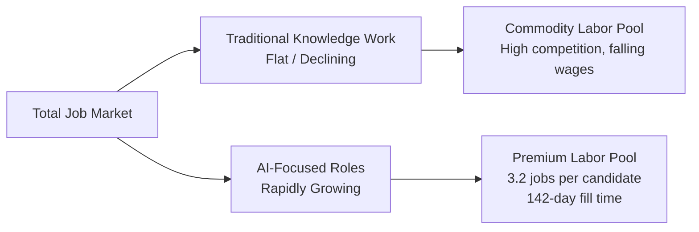

**Parent**: [[topics]]

# The AI Job Market

## Overview
The AI labor market has split into two markets moving in opposite directions. Traditional knowledge work — generalist PMs, standard software engineers, conventional business analysts — is flat or declining. Roles that design, build, operate, and manage AI systems are growing at a pace rarely seen in tech. The result is a K-shaped curve where position relative to that dividing line determines whether the market feels impossible or like writing your own ticket.

## Market Statistics
- **3.2 to 1** ratio of AI jobs to qualified candidates (Manpower Group survey)
- ~1.6 million open AI roles vs. ~500,000 qualified applicants
- **142 days** average time to fill an AI role — nearly half a year
- Employers report being unable to fill roles after hundreds of interviews

## Why the Split Is Confusing Job Seekers
Two dynamics obscure what is actually happening:

- **Employers using interviews as learning tools** — companies that don't fully understand AI use resume screening and interviews to learn from candidates what they need, rather than to evaluate fit. This wastes talent time and produces no hires.
- **Overstated qualifications** — candidates claiming AI proficiency who lack the specific skill sets employers actually need. The ability to chat with an AI is not the bar.

> *"If you're not in that half a million category, it does feel impossible because the entire rest of the job market is condensing into commodity."*

## What This Means for Job Seekers
- Candidates on the AI-skilled side of the split can command their price and face few competitors
- Candidates on the traditional side are competing in a shrinking pool against a growing number of peers
- The seven skills covered in the rest of this vault represent the specific competency gap employers are unable to fill

