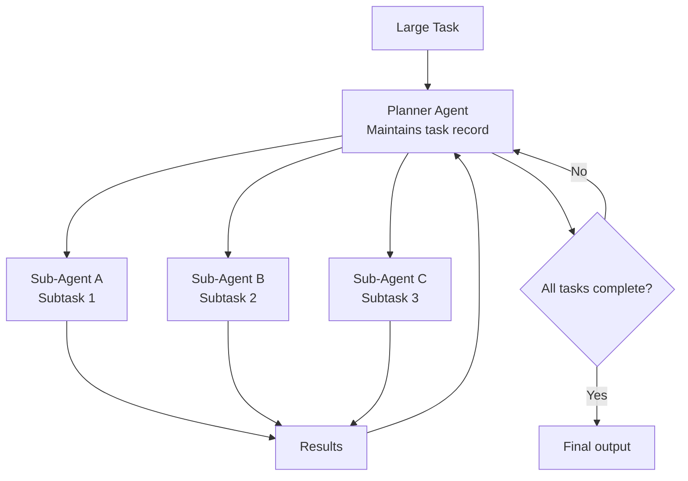

**Parent**: [[topics]]

# Multi-Agent Task Decomposition

## Overview
Multi-agent task decomposition is the skill of breaking large, complex work into clearly scoped subtasks that can be reliably delegated to individual agents. Despite sounding highly technical, the core of this skill is managerial: it maps directly onto how experienced project managers divide work into workstreams. The critical difference is that agents require far more explicit definition of scope, handoffs, and constraints than human teams do.

## Why Agents Need Tighter Decomposition Than People
A human team given a loosely decomposed set of assignments will exercise judgment, ask clarifying questions, and fill gaps collaboratively. Agents cannot do this reliably. They need:
- Explicit goal definition
- Precisely stated initial intent
- Clear rules for how subtasks hand off between agents
- Guard rails and infrastructure to operate within

> *"You have to very clearly specify the goal, very clearly specify your initial intent, very clearly define how you want a multi-agent system to run."*

## Current Best-Practice Architecture
The dominant pattern in 2026: a **planner agent** maintains a record of tasks and coordinates with a set of **sub-agents**, each responsible for a defined scope of work. The planner makes routing decisions; sub-agents execute.

If work is sized for a **single-threaded harness** (one agent working sequentially), tasks must be decomposed small enough to fit within that agent's context and capability. If work uses a **multi-agent harness**, the planner can manage larger tasks — but the subtask definitions and logical relationships must still be explicit enough that the planner makes good routing choices.

## Sizing Work to the Harness
One of the most practically valuable sub-skills: knowing whether a given project is correctly scoped for the agentic setup being used. Misjudging this leads either to:
- Tasks too large for the harness → context degradation and failed runs
- Unnecessary multi-agent complexity for tasks that could be single-threaded

## The Coordinator Scoping Mistake
The most common failure in coordinator-subagent patterns is not in the sub-agents — it's in how the coordinator scopes their work. A coordinator that breaks tasks down too narrowly will produce sub-agents that execute perfectly but miss entire domains.

**Example:** Ask an agent to research "AI in creative industries" and the coordinator creates subtasks only about visual arts (digital art, graphic design, photography) — completely missing music, writing, film, and game design. The sub-agents did their jobs; the coordinator gave them the wrong jobs.

**Fix:** Give the coordinator **broad goals, not narrow checklists**. Let sub-agents determine how to break down their own subtasks. The coordinator's job is to define the territory; the sub-agents' job is to map it.

## Sub-Agent Isolation
Each sub-agent operates in its own isolated context window with its own task set — sub-agents have no visibility into what other sub-agents are doing or have done. Sub-agent A will have no idea what Sub-agent B found. All results flow back to the main coordinator, which synthesizes outputs at the end.

This isolation is intentional and generally beneficial — it keeps each agent focused. When agents genuinely *need* to communicate mid-run (checking who's blocking who, coordinating dependencies), that requires the **Agent Teams** feature, which gives each agent the equivalent of an email inbox so they can message each other directly.

## Who Has a Head Start
- **Project managers** experienced breaking large initiatives into workstreams
- **Engineering leads** who have decomposed epics into tickets
- Professionals comfortable thinking about logical dependencies and handoff points

The mental model that transfers: *what are the logical delineations in this work, what can be done in parallel, and how do results flow from one stage to the next?*

