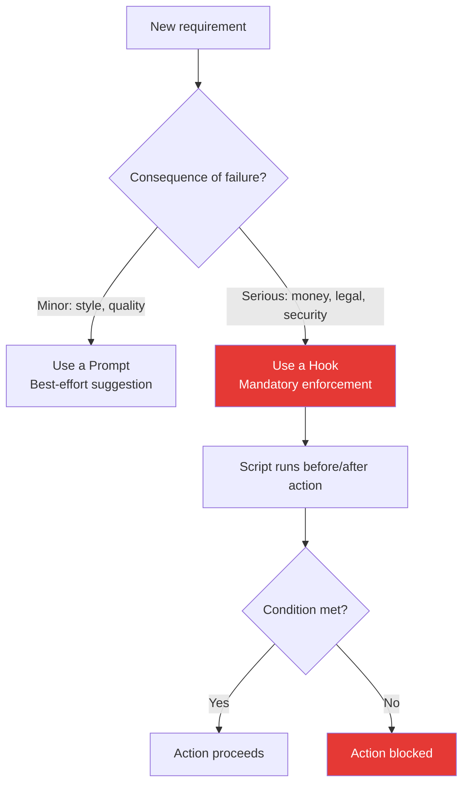

**Parent**: [[topics]]

# Prompts vs. Hooks

## Overview
The distinction between prompts and hooks is one of the highest-leverage concepts in the Claude Certified Architect exam guide. Both influence Claude's behavior, but they operate at fundamentally different levels of reliability. Misapplying prompts where hooks are needed is one of the most common and costly mistakes in production agentic systems.

## Prompts: Best Effort
A prompt tells Claude what to do. It works most of the time — sometimes 90%, sometimes 99% — but it cannot guarantee 100% compliance. No amount of prompt refinement changes this fundamental property. Prompts are suggestions encoded as language.

**Best for:** Style, tone, formatting, and output preferences — areas where occasional deviation causes inconvenience rather than harm.

**Example failure:** An instruction to "always verify customer identity before processing a refund" was skipped in 12% of real production cases — the agent went straight to order lookup, occasionally misidentifying accounts. At scale, a 12% failure rate in a financial process is not acceptable.

## Hooks: Mandatory Enforcement
A hook is a small script that runs automatically before or after Claude attempts an action. It can physically block the action unless a specific condition is met. There is no probability distribution — the action either satisfies the condition or it does not happen.

**Best for:** Compliance, financial transactions, security-critical operations — anywhere a single failure causes real harm.

> *"Prompts are suggestions. Hooks are laws."*

## Decision Framework

| Criterion | Use a Prompt | Use a Hook |
|---|---|---|
| What it controls | Style, tone, format | Compliance, security, finance |
| Reliability needed | ~90%+ is acceptable | Must be 100% |
| Consequence of failure | Minor quality issue | Legal, financial, or security harm |
| Mechanism | Language instruction | Script that blocks execution |

## Why This Matters at Scale
Over thousands or tens of thousands of agent invocations, a 1% failure rate becomes a significant operational problem. A prompt that works perfectly in testing will produce failures in production at sufficient volume. Hooks remove the probability entirely for the cases where that matters.

The common mistake: when an agent fails to follow an instruction, the response is to "tweak the prompt." There is a ceiling on what prompt refinement can achieve. When you cross the threshold into compliance, financial, or security requirements, only structural enforcement works.

