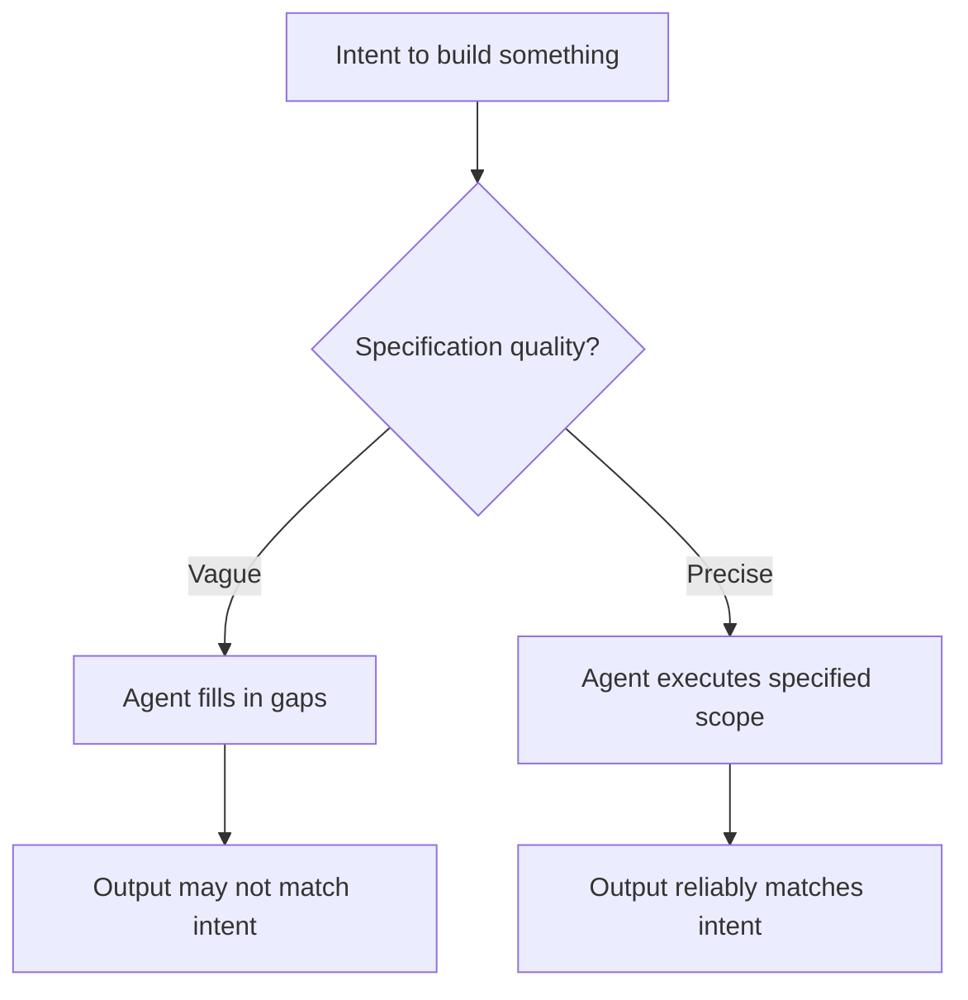

**Parent**: [[topics]]

# Specification Precision

## Overview
Specification precision — also called clarity of intent — is the ability to communicate instructions to an AI agent with machine-literal clarity. Unlike human colleagues who read between the lines and infer unstated intent, agents take specifications literally and attempt to fill in any gaps themselves, usually unreliably. This skill is the foundation on which every other agentic skill is built, and it appears consistently across job postings regardless of role type.

## Why Agents Need Precise Specs
Agents operate without the social and contextual inference that humans use automatically. When given a vague instruction, an agent will do its best to fill in the blanks — but that gap-filling won't reliably reproduce the requester's actual intent.

> *"Agents are bad at filling in the blanks."*

The bar for prompting in 2026 is meaningfully higher than it was in earlier AI adoption phases. Writing "improve customer support" is not a specification. A specification names the exact scope of the system, its capabilities, its escalation rules, its data inputs, and its success criteria.

## What a Precise Specification Looks Like
**Vague intent:** *"Build something to handle customer support."*

**Precise specification:**
- Handle tier-one tickets: password resets, order status inquiries, return initiations
- Know when to escalate to a human based on customer sentiment
- Define sentiment measurement criteria explicitly in attached docs
- Log every escalation with a reason code

The delta between these two is the skill. Both share the same goal; only one gives an agent enough to work with.

## Who Has a Head Start
Professionals already trained in precise technical communication transfer naturally:
- **Technical writers** — accustomed to unambiguous documentation
- **Lawyers** — trained to anticipate literal interpretation and edge cases
- **QA engineers** — experienced writing test cases that leave no room for interpretation

For others, the skill is learnable — it requires understanding in detail what you actually intend to build before you start writing.

## Where This Skill Appears in Job Postings
Appears across engineering, operations, and product management roles. Sometimes labeled "prompting," increasingly labeled "specification precision," "clarity of intent," or "agentic instruction design."

