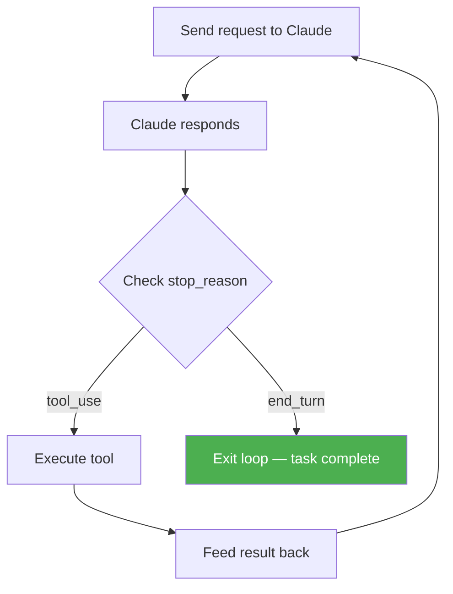

**Parent**: [[topics]]

# The Agentic Loop

## Overview
The agentic loop is the core engine powering every Claude agent, whether running in Claude Code, the Anthropic SDK, or any agentic framework built on top of Claude. Understanding it precisely is the foundation for everything else in agentic system design — every tool call, sub-agent spawn, and termination condition runs through this loop.

## How It Works
1. Code sends a request to Claude
2. Claude responds
3. Check the `stop_reason` field in the response:
   - `tool_use` → execute the requested tool, feed the result back, repeat
   - `end_turn` → Claude is done; exit the loop

The loop terminates when Claude signals completion through `stop_reason`, not through anything it says in the text of its response.

## The Three Anti-Patterns

### 1. Reading text for completion signals
Checking Claude's response text for phrases like "I'm done" or "task complete" is unreliable and breaks inconsistently. The `stop_reason` field exists precisely so you never need to parse text for this.

### 2. Setting arbitrary loop limits
Capping the loop at 10 iterations (or any fixed number) risks cutting off work that genuinely requires more steps. The right depth depends on the task — you may not know it requires 11 steps until the agent is already at step 10.

### 3. Inferring completion from Claude's statements
Using what Claude *said* to decide if it's finished confuses response content with protocol signal. Only `stop_reason` is authoritative.

## Key Principle

> Check `stop_reason`, not Claude's words — it is the only reliable signal for loop control.

When running Claude Code interactively in a terminal, `stop_reason` may not be visible. But every file read, tool execution, command run, and sub-agent spawn still flows through this loop under the hood.

