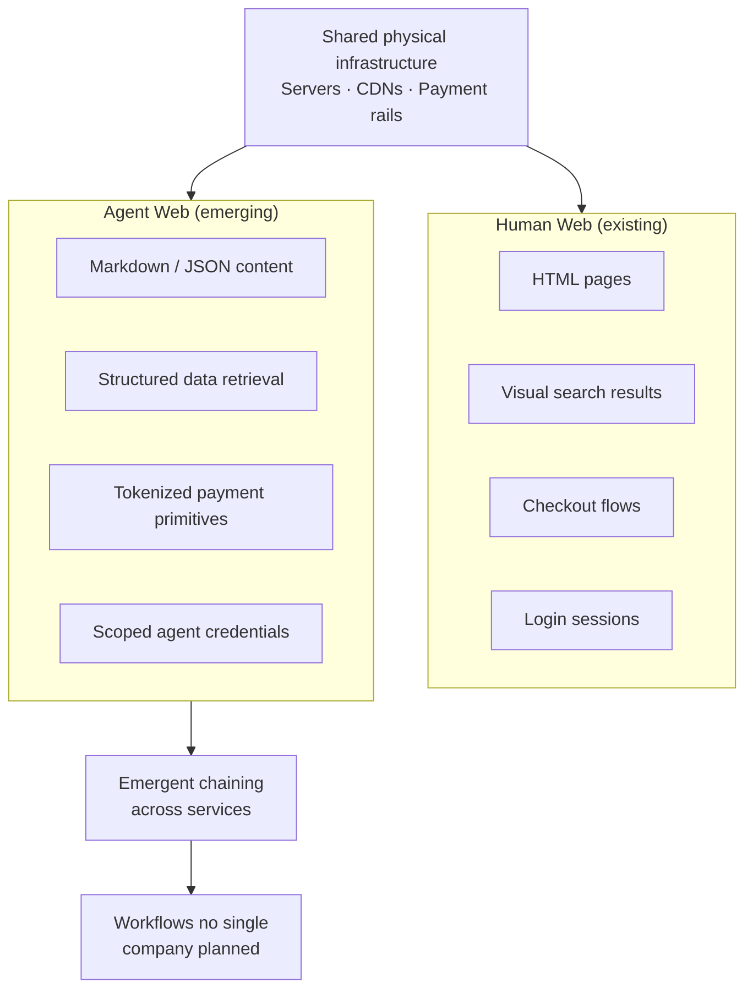

**Parent**: [[topics]]

# The Forking Web

## Overview
The web is splitting into two parallel systems running on the same physical infrastructure. The human web — with fonts, layouts, images, scroll animations, and visual trust signals — exists alongside an emerging agent web: a parallel layer of APIs, structured data, markdown content, payment protocols, and execution environments designed for software that will never open a browser. The companies building agent-native primitives today are not startups hoping to get lucky — they are Coinbase, Stripe, Cloudflare, Google, OpenAI, Visa, and PayPal, with the scale and distribution to make their design decisions into de facto web standards.

## The Two Webs

| | Human Web | Agent Web |
|---|---|---|
| **Content format** | HTML with layout, images, ads | Markdown or JSON |
| **Navigation** | Visual browsing | Programmatic API calls |
| **Search** | 10 blue links, featured snippets | Structured data, raw URLs |
| **Payment** | Checkout flows with visual trust signals | Tokenized payment primitives |
| **Identity** | Login forms, sessions | Agent credentials, scoped tokens |

Both webs run on the same servers, CDNs, and payment rails — but they serve fundamentally different clients with incompatible needs.

## The Mobile Web Analogy

> *"We are at the same inflection point today except the new client isn't a smaller screen. It's not a screen at all."*

When the iPhone launched in 2007, the web existed and technically worked on phones — but it was designed for desktops. What followed was a decade-long rebuild: responsive design, mobile-first frameworks, app stores, push notifications, GPS-aware services, tap to pay.

The companies that recognized the fork early and built for the new client — not trying to make the old interface work on a new device — built the dominant platforms of the next era: Uber, Instagram, WhatsApp, Snap. None could have existed on the desktop web, not because it lacked information, but because it lacked the interface primitives mobile clients needed (real-time location, always-on connectivity, camera-first interaction, tap to pay at physical registers).

The agent fork follows the same pattern. The businesses that emerge from it will be the ones that could not have existed on the human web — not because the human web lacks information, but because it lacks the interface primitives agent clients need:
- Structured data
- Tokenized payments
- Machine-readable content
- Programmatic search
- Execution environments

## Emergent Chaining: The Forking Web in Action
A developer connected OpenClaw to a video generation model (Kling 2.0) via an app called Chatcut. He gave the agent an Amazon product link. The agent:
1. Crawled the Amazon page
2. Extracted product info and photos
3. Identified assets suitable for video generation
4. Fed them into the video model
5. Produced a UGC-style product video

**No human touched any step between "paste this link" and "here's your video."**

The Amazon page wasn't designed for agents. The video model wasn't designed to receive input from web crawlers. The orchestration app wasn't designed as a workflow layer. But because each service exposes its capabilities through APIs and structured data, the agent stitched them together into a workflow no individual company planned.

> *"The emergent web is not a platform that any one person is going to build. It's what happens automatically when the primitives exist and the agent is smart enough to combine them."*

This is the pattern that infrastructure convergence makes inevitable. When content is available as markdown, search returns structured data, execution happens in containers, and payment flows through tokenized protocols — agents can chain any two services together without a pre-built integration.

## The Creator Economy Implication
A UGC product video previously cost brands ~$1,000 and required a human creator. The agent workflow above replicates it from a single link, at near-zero cost, in minutes. Not with human creative judgment — but at a scale and economics that changes the calculus entirely.

Multiply across every content type that follows a repeatable pattern — product descriptions, social posts, email campaigns, comparison articles — and the scale infrastructure companies are building for (which isn't there yet) starts to make sense. They are building for a world where this kind of emergent agent behavior is the norm, not a demo.

## The Trust Gap
The infrastructure being built assumes a fully autonomous world: agents with their own wallets, search, execution environments, and economic relationships with the services they use. Human comfort with agent autonomy currently sits around **70% human control** of delegated tasks. The infrastructure assumes 0% — full autonomy.

> *"The gap between the infrastructure being built and the trust people are willing to extend to agents is the central tension of the next few years in AI."*

Every security incident — OpenClaw remote code execution, databases wiped by unsupervised agents — pushes the trust timeline back without stopping adoption. The primitive of trust is the one that cannot be built by infrastructure companies alone; it has to be earned through accumulated good-faith agent behavior over time.

