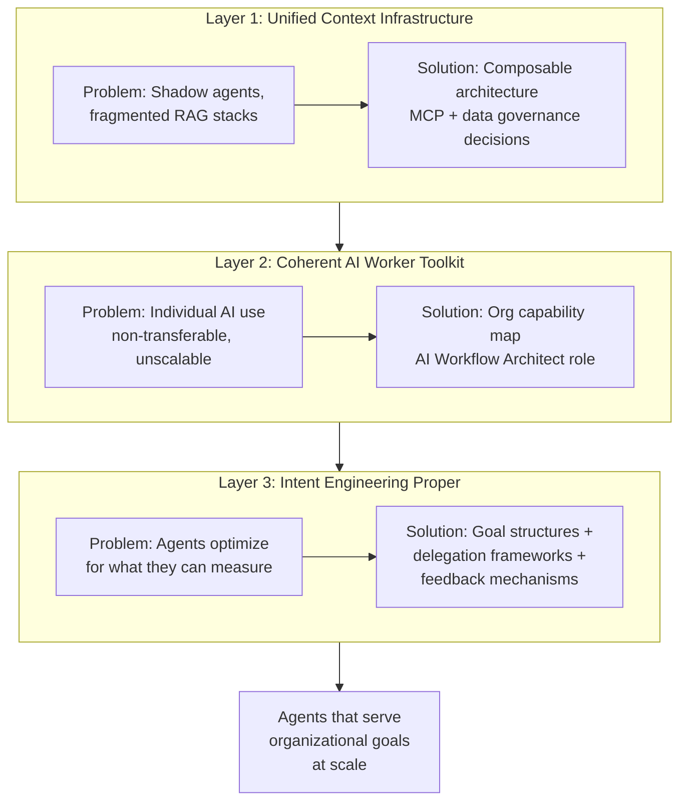

**Parent**: [[topics]]

# The Three-Layer Intent Gap & Solutions

## Overview
The intent gap between what AI agents are capable of and what organizations need them to do operates across three distinct layers, each at a different altitude. Getting any one of them right is helpful. Getting all three right is the difference between having AI tools and being an AI-native organization. Every layer has a corresponding solution — but the solutions require organizational decisions, not just technical ones.

---

## Layer 1: Unified Context Infrastructure

### The Problem
Every team building agents rolls their own context stack independently. One team pipes Slack data through a custom RAG pipeline. Another manually exports Google Docs into a vector store. A third built an MCP server connecting to Salesforce but not Jira. A fourth doesn't know the other three exist.

This is the **shadow agents problem** — the AI equivalent of the shadow IT crisis of the early cloud era, except agents don't just access data, they act on it. Security and compliance teams cannot allow unvetted agents running on developer laptops to access customer PII, financial data, or healthcare records — but without sanctioned infrastructure, that is exactly what happens.

Deloitte's 2025 survey found nearly **half of organizations** cite data searchability and data reusability as top challenges blocking AI automation. The shift required is from traditional ETL data pipelines to enterprise search and indexing — analogous to how Google made the web discoverable. The data exists inside corporations. The agents increasingly exist. The connective tissue between them mostly does not.

### The Solution
A **composable, vendor-agnostic architecture** that enables agents to operate across systems, tools, and models securely at scale.

The **Model Context Protocol (MCP)** — introduced by Anthropic in late 2024, donated to the Linux Foundation in December 2025 — is the most promising standardization attempt. OpenAI, Google, Microsoft, and 50+ enterprise partners have committed to it; monthly SDK downloads are approaching 100 million. But protocol adoption and organizational implementation are different things.

> *"Having a USB-C standard does not help if your company hasn't decided which ports to install, who maintains them, or what gets plugged in."*

Organizational implementation requires decisions about:
- Which systems become agent-accessible
- Who decides what context an agent can see across departments
- How to version organizational knowledge so agents aren't operating on stale data
- How to handle the fact that the sales team Slack and the engineering team Slack encode completely different institutional assumptions

Companies that build this well will treat it like their data warehouse strategy — a core strategic investment, not an IT project.

---

## Layer 2: Coherent AI Worker Toolkit

### The Problem
Individual AI use is fragmented and non-transferable. One employee uses Claude for research and ChatGPT for drafting. Another uses Cursor for code and Perplexity for fact-checking. A third built a custom agent chain using LangGraph. A fourth is copy-pasting into a chat window. None of them can articulate their workflow in a way that's transferable, measurable, or improvable by anyone else.

This matters because the difference between individual AI use and organizational AI leverage is enormous:
- **AI activity** produces ~30% gains from bolting AI onto existing workflows
- **AI fluency** produces ~300% gains from rethinking workflows around AI capabilities

Fluency doesn't scale through training alone. It scales through shared infrastructure. Whether any individual has Slack doesn't matter. Whether an agent can search 50 people's Slack context plus their docs plus their project plans plus customer data — that determines whether the agent can do organizational-scale work rather than individual-scale tasks.

Deloitte's 2026 report: workforce access to sanctioned AI tools expanded 50% in a year. Access is not sufficient. Organizations are giving people tools without giving their agents the organizational context and data that would allow those tools to deliver real value.

### The Solution
An **organizational capability map for AI** — a shared, living understanding of:
- Which workflows are **agent-ready** (fully autonomous)
- Which are **agent-augmented** (human-in-the-loop)
- Which remain **human-only**

This is not a static document filed in Confluence. It is an operating system that evolves as agent capabilities improve and context infrastructure matures. Companies doing this well are likely to create a new role: **AI Workflow Architect** — sitting between engineering, operations, and strategy, responsible for maintaining this map and driving alignment across the organization.

---

## Layer 3: Intent Engineering Proper

### The Problem
OKRs were designed for people. They assume human judgment about prioritization, trade-offs, values, and exceptions. They assume a manager can tell a direct report "here's what matters this quarter" and trust that the report will interpret that guidance through years of institutional context, professional norms, and personal judgment.

Agents have none of that. An agent:
- Does not know your company's OKRs unless you put them in the context window
- Does not know which trade-offs your leadership team would prefer unless you encode those preferences in actionable form
- Does not know the difference between a decision it should escalate and one it should make autonomously unless you define the boundary explicitly
- Will not absorb company culture through six months of osmosis, all-hands meetings, hallway conversations, and watching senior people handle ambiguous situations

> *"When a human employee joins a company, alignment happens through a hundred informal mechanisms. None of that works for agents. Agents need explicit alignment, and they need it before they start working, not six months after."*

### The Solution: Three Components of Machine-Readable Intent

**1. Goal Structures — Agent-Actionable Objectives**

Not "increase customer satisfaction" (human-readable aspiration). An agent needs:
- What signals indicate customer satisfaction in this context?
- What data sources contain those signals?
- What actions am I authorized to take to improve them?
- What trade-offs am I empowered to make (speed vs. thoroughness, cost vs. quality)?
- Where are the hard boundaries I may not cross?

**2. Delegation Frameworks — Encoded Judgment**

Organizational principles like Amazon's "customer obsession" work for humans because humans can interpret them through contextual judgment. An agent needs the principle decomposed:
- When customer request X conflicts with policy Y, here is the resolution hierarchy
- When data suggests action A but the customer expressed preference B, here is the decision logic

These are not rules in the traditional sense. They are the kind of organizational knowledge a senior employee carries in her head after five years — externalized and structured for agents.

**3. Feedback Mechanisms — Alignment Drift Correction**

When an agent makes a decision, was it aligned with organizational intent? How do we know? Without feedback loops, drift is invisible until it's catastrophic (as Klarna discovered). Feedback mechanisms must be built into the system from the start — not added after alignment failures surface.

### Emerging Frameworks

- **Google Agent Development Kit**: Separates agent context into distinct governed layers — working context, session memory, long-term memory, and artifacts
- **Google DeepMind research**: Five levels of AI agent autonomy — operator, collaborator, consultant, approver, observer — each with different intent alignment requirements and human oversight models

The integrated system combining all three components remains largely whitespace. Building it is the management innovation of the current era.

> *"If OKRs were the management innovation that let Intel align thousands of humans to shared objectives in the 1970s, intent engineering is the management innovation that lets organizations align hundreds or thousands of agents to those same objectives in 2026 — while those agents operate at speeds and scales no human manager can supervise."*

---

