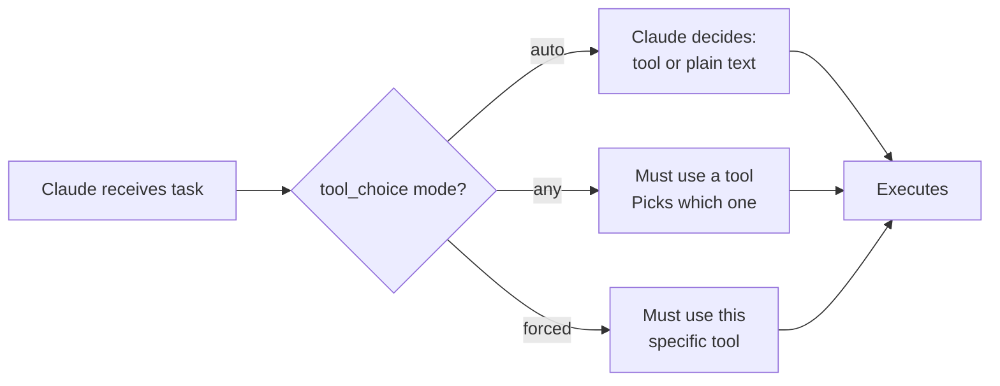

**Parent**: [[topics]]

# Tool Descriptions & Tool Overload

## Overview
How Claude selects which tool to use is driven almost entirely by tool descriptions — not by which tools exist or what they actually do. Vague, overlapping, or ambiguous descriptions are the single most common cause of wrong tool calls in production agentic systems. Getting descriptions right is the highest-leverage improvement available in most agentic workflows.

## The Description as Interface
A tool's description is the interface between Claude's reasoning and the function that gets executed. Claude cannot inspect code; it can only read descriptions. This means:
- Two tools with vague overlapping descriptions will be confused regularly
- Claude ends up guessing which tool is appropriate
- The result may look correct in testing while being inefficient — wrong tool attempted 3–4 times before the right one fires, burning tokens on each failed attempt

**Example fix:**

| Tool | Bad description | Better description |
|---|---|---|
| `get_customer` | "retrieves customer information" | "Use when you need customer ID and profile data. Do NOT use when you have an order number." |
| `lookup_order` | "retrieves order information" | "Use when you have an order number and need shipping status. Do NOT use for customer profile data." |

The negative constraint ("do NOT use when...") is as important as the positive one. Defining the boundary between similar tools explicitly is what prevents misrouting.

## The Tool Overload Problem
Giving an agent 18 tools is like onboarding a new employee with access to every system on day one — they will use things they shouldn't, call tools outside their lane, and make worse decisions the more options they have.

**Rule: Maximum 4–5 tools per agent**, all directly relevant to that agent's specific task. This constraint is what makes agents precise and reliable.

When complex workflows require many tools, split them across specialized sub-agents — each holding only the tools relevant to its narrow scope.

## Tool Choice Modes
The `tool_choice` setting controls how Claude selects tools:

| Mode | Behavior | When to Use |
|---|---|---|
| `auto` | Claude decides whether to use a tool at all | General-purpose agents |
| `any` | Claude must use a tool; it picks which one | When a tool call is always required |
| `forced` | Claude must use this specific tool | Step 1 must always be consistent and predictable |

**Pattern: Constrain early, release later.** Force the first move(s) to be predictable, then loosen the constraint and let the agent run autonomously once it has been steered in the right direction.

