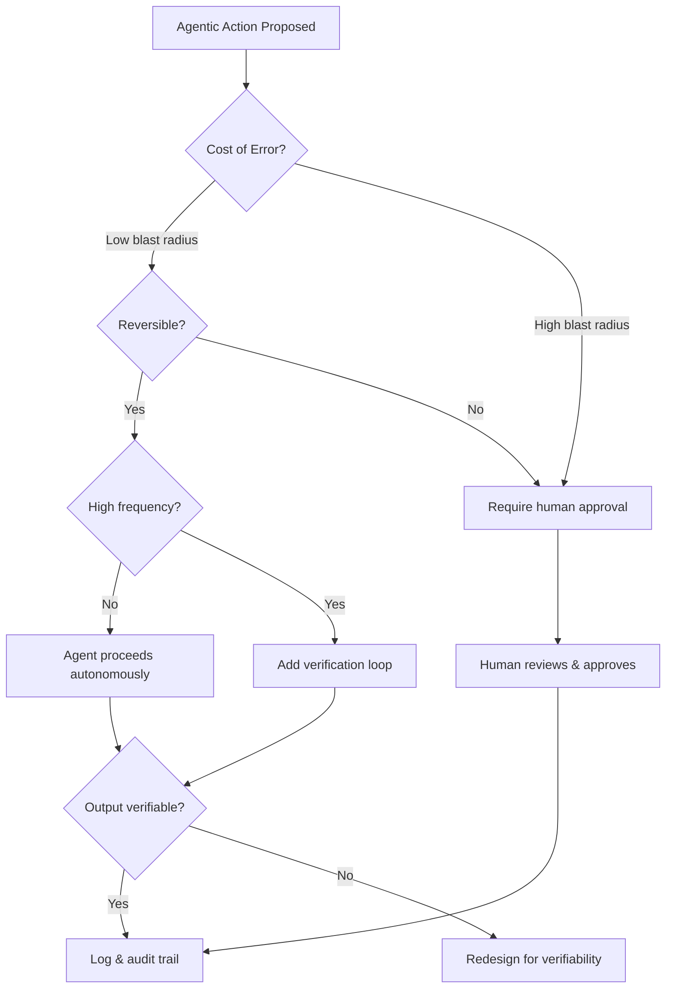

**Parent**: [[topics]]

# Trust and Security Design

## Overview
Trust and security design is the skill of determining where and how to deploy agentic systems safely — drawing the line between autonomous agent action and required human oversight, and building the guardrails that make that line enforceable. Because agentic systems are probabilistic, not deterministic, well-intentioned system prompts alone ("be nice," "be accurate") are not sufficient. The skill is building structural constraints that make correct behavior the reliable default.

## Core Questions This Skill Answers
- Where does an agent operate autonomously, and where must a human approve?
- What actions is the agent authorized to take, and how do you verify it only took those?
- How do you prevent an agent from saying something harmful or incorrect to a customer?
- How do you bound the impact if something goes wrong?

## The Functional vs. Semantic Correctness Standard
A critical sub-skill: insisting on **functional correctness**, not just **semantic correctness**.

- **Semantic correctness**: The agent says something that sounds right ("This is the best credit card for you.")
- **Functional correctness**: The agent says something that is actually right (the recommended card is genuinely appropriate for this customer's profile)

Building systems that enforce functional correctness — and measuring against that standard — is one of the highest-value things this skill produces.

## Key Sub-Skills for Designing Guardrails

### Cost of Error (Blast Radius)
What is the worst-case consequence of a failure in this system? The design of guardrails should be proportional to impact. A misspelled draft email and an incorrect drug interaction recommendation require radically different safety architectures.

> *"You have to understand what is the blast radius of particular problems."*

### Reversibility
Can the agent's action be undone? A draft email can be reviewed before sending. A completed wire transfer cannot be recalled. Irreversible actions require either human approval gates or much higher confidence thresholds before execution.

### Frequency
How often does this action occur? A high-frequency action with even a small error rate compounds into significant aggregate harm. A rare action may tolerate more uncertainty. Volume changes the risk calculus entirely.

### Verifiability
Can you confirm the output was correct? Designing systems to produce verifiable outputs — audit trails, reason codes, logged decisions — is essential for catching errors before they become incidents and for root-causing problems after the fact.

## Who Has a Head Start
- **Risk managers and compliance professionals** — experienced mapping worst-case scenarios and building controls
- **Security engineers** — familiar with trust boundaries, authorization models, and least-privilege design
- **Operations leaders** — practiced at designing processes with appropriate human checkpoints

## Organizational Trust Architecture
At enterprise scale, the mental model of agents as infrastructure — like servers or databases, things you configure and forget — is dangerously wrong. An agent with access to sensitive information and autonomous decision-making authority is a personnel risk: an insider threat that never sleeps, operates at machine speed, and doesn't telegraph discomfort before it acts.

**Scale of the problem (late 2025 data):**
- Palo Alto Networks found autonomous agents outnumber human employees in the enterprise at an **82:1 ratio** (machine identities, agents, automated systems, service accounts)
- Only **34%** of enterprises have AI-specific security controls in place
- Fewer than **40%** conduct regular security testing on AI models or agent workflows
- Galileo AI research found that in simulated multi-agent systems, a single compromised agent poisoned **87% of downstream decision-making** within hours — faster than traditional incident response could contain it

**What organizational structural failure looks like:**
A real case: an organization discovered after quarters of work that Claude had been hallucinating company numbers at scale — fabricating figures for board decks and sales decisions that drove territory planning for months. The person assigned to work with Claude believed the numbers. Leadership believed them. Claude was operating within its assigned permissions, accessing authorized systems, producing the kinds of outputs it was supposed to produce. The breach looked like the system working correctly.

**The required reframe:** Stop treating agents as trusted infrastructure. Start treating them as untrusted actors operating within structurally enforced boundaries — the same way well-designed financial systems treat every employee, including the CFO, as a potential fraud risk.

**Concrete structural controls:**
- Verify the identity of every agent; do not share service accounts
- Enforce least-privilege access — do not grant broad permissions just to get things done
- Behavioral monitoring that detects anomalous patterns in real time
- Automated escalation triggers when agents approach decision boundaries
- Assume safety prompting alone is insufficient — Anthropic's own research shows explicit commands reduce but do not eliminate harmful agent behavior

**Emerging frameworks:**
- OWASP has published a taxonomy of 15 threat categories for agentic AI (memory poisoning to human manipulation)
- CyberArk is pushing identity-first security models that treat agents like privileged users, not servers
- Anthropic and Palo Alto research teams are both calling for zero trust architectures that extend to the agent layer

